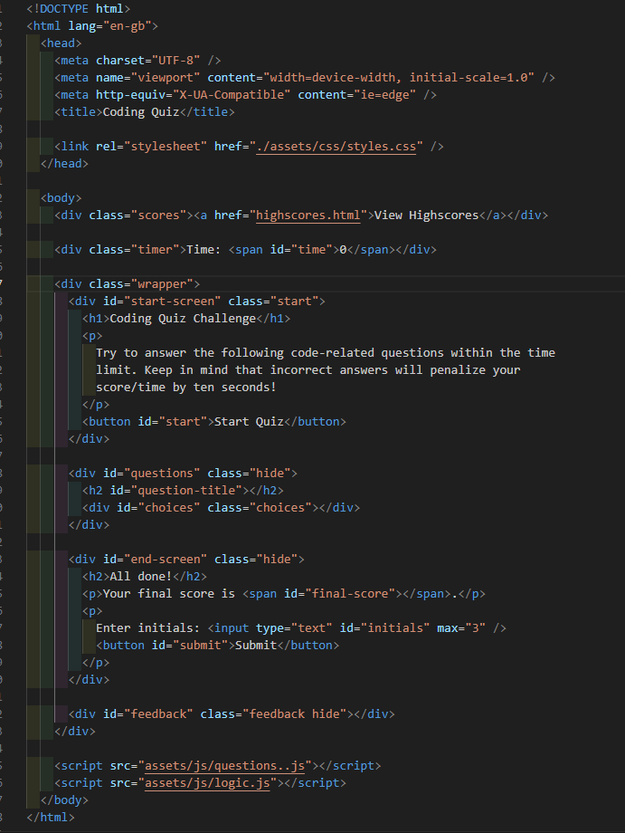
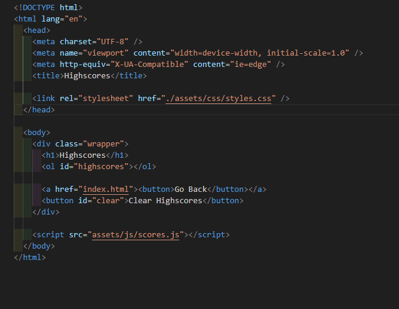
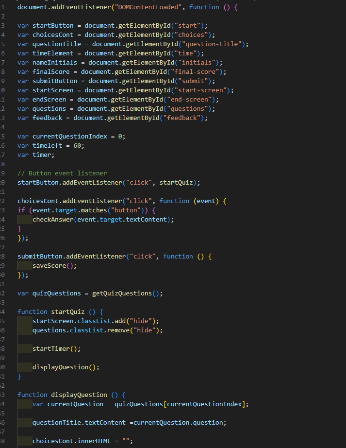
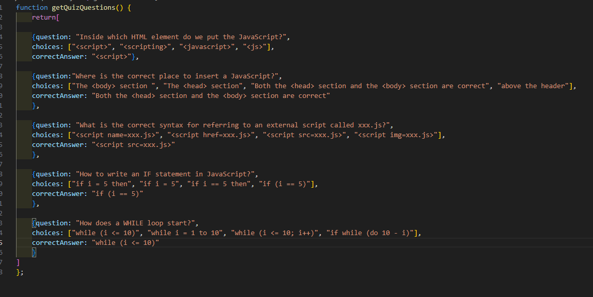
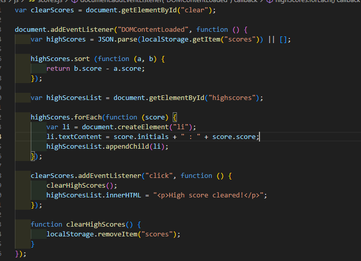
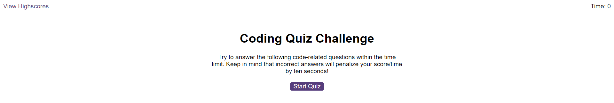
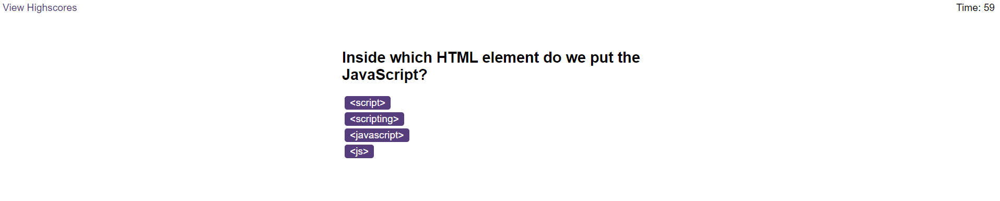
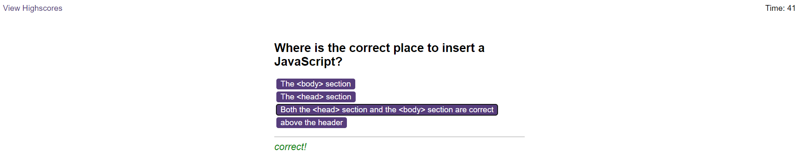
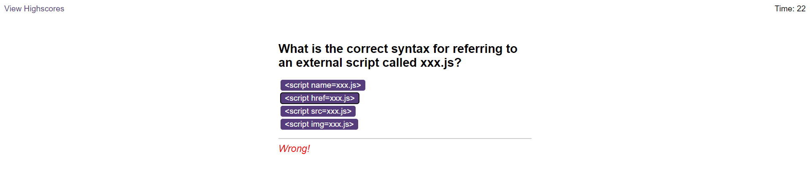
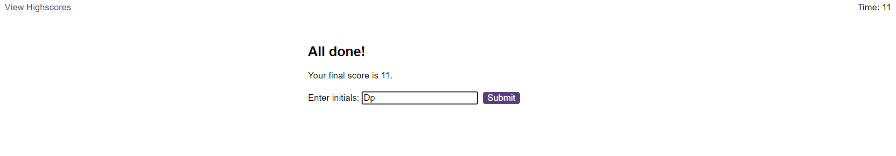

# Web-API-Quiz-Dominic
Quiz created using web API's 
This quiz was created using 3 different Javascript files and two HTML files. 
One HTML file holds the main index and structer 
The second HTML holds the structure for the high scores page. 
The Javascript has been split into three different files to make readability easier. The logic, questions and scores have been split into their own files.
The logic behind how this quiz works has been created using the DOM and and local storage. 

See screan shots of the files below.

Index.HTML

Highscores.HTML

Logic.js 

Questions.js

Scores.js

And below see screenshots of working page. 

Link to git repo: https://github.com/dpaul93/Web-API-Quiz-Dominic

Link to live page: https://dpaul93.github.io/Web-API-Quiz-Dominic/